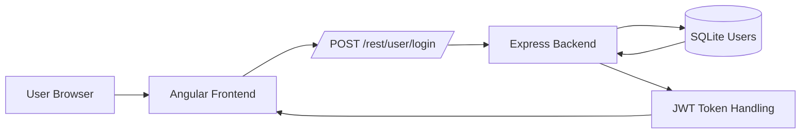
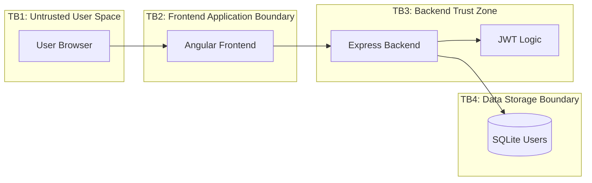

# Threat Modeling / Risk Assessment of OWASP Juice Shop

## Summary
The purpose of this project is to do a simulated threat modeling of the popular, intentionally vulnerable web app OWASP Juice Shop. After creating a system architecture overview, a data flow diagram, and trust boundary diagram of the application, we will focus on assessing 3 features of the application:

1. The login authentication flow
2. The inventory search feature
3. The profile image upload feature

For each feature, we will do the following:

1. Analyze threats following the STRIDE framework
2. Outline a risk register
3. Conduct a gap analysis
4. Map risks to ISO 27001 and NIST SP 800-53 controls

Let's get started!

## Table of Contents
* [System Architecture Overview](#sao)
* [Data Flow Diagram](#dfd)
* [Trust Boundary Diagram](#tbd)
* [Login Authentication](#auth)
* [Inventory Search](#search)
* [Profile Image Uplaod](#upload)

## System Architecture Overview 

## Data Flow Diagram

## Trust Boundary Diagram

## 1. Login Authentication Threat Model

### Objective
Assess the authentication feature for security risks related to credential submission, token issuance, session trust, and authorization dependencies.

### Scope
- Login submission
- Backend credential validation
- Token issuance and return to client
- Authentication-related trust boundaries

### Included
- Architecture overview
- Data flow diagram
- Trust boundary diagram
- STRIDE analysis
- Gap analysis
- Risk register
- NIST / ISO mapping

### 1.1 Architecture Overview

### 1.2 Data Flow Diagram

#### Flow
1. User enters email and password in the browser
2. Angular frontend sends login request to backend
3. Express login handler validates credentials against user data
4. Backend issues authentication token on success
5. Token and auth state are returned to the client

#### Security-Critical Points
- Credentials cross from untrusted user space into the application
- User lookup and password validation happen server-side
- Token generation and validation are high-trust functions

### 1.3 Trust Boundary Diagram

### 1.4 STRIDE Analysis

| Threat | Example | Risk |
|------|--------|------|
| Spoofing | Brute force login | High |
| Tampering | Modify login request | Medium |
| Repudiation | No login logs | Medium |
| Info Disclosure | Error leaks | High |
| DoS | Login flooding | Medium |
| EoP | JWT manipulation | Critical |

### 1.5 Risk Register

| ID | Risk | STRIDE | Likelihood | Impact | Risk Level | Mitigation |
|---|---|---|---|---|---|---|
| AUTH-01 | Brute-force / credential stuffing | Spoofing | High | High | Critical | Rate limiting, lockout, MFA |
| AUTH-02 | Token forgery or weak validation | Elevation of Privilege | Medium | Critical | Critical | Signature verification, strict token validation |
| AUTH-03 | Verbose login error responses | Information Disclosure | High | Medium | High | Generic error messages |
| AUTH-04 | Incomplete login audit trail | Repudiation | Medium | Medium | Medium | Centralized auth logging |
| AUTH-05 | Session hijack / token misuse | Tampering / EoP | Medium | High | High | Secure token storage and expiration |

### 1.6 Gap Analysis

#### Step 1: Expected Controls
For an authentication feature, the expected controls are:

- Server-side credential validation
- Strong token signing and verification
- Rate limiting / brute-force protection
- Secure session or token handling
- Generic authentication failure responses
- Audit logging for login attempts and suspicious activity
- Authorization dependency on validated identity

#### Step 2: Observed / Inferred Controls from Reviewed Scope
- Login route and authentication flow are clearly present
- Token-based authentication logic is part of the backend design
- Centralized auth-related middleware is present in route composition
- Some rate limiting is visible elsewhere in the application, but full login-specific brute-force control coverage should be validated separately

#### Step 3: Gap Classification

| Control | Status | Gap |
|---|---|---|
| Server-side credential validation | Present | No major gap at architectural level |
| Token issuance | Present | Token lifecycle hardening depth should be validated |
| Token validation consistency | Partial | Full coverage across all auth-dependent routes should be verified |
| Login brute-force protection | Needs validation | Login-specific throttling or lockout is not fully established from this feature view alone |
| Generic auth failure responses | Needs validation | Error-message handling depth should be confirmed in implementation and UI |
| Audit logging for login events | Partial | Logging expectations exist, but completeness and retention are not established from reviewed scope |
| Session/token revocation controls | Not evident | Revocation, rotation, or session invalidation behavior is not clear from this feature slice |

#### Step 4: Security Impact of the Gaps
- If brute-force protections are weak, spoofing risk increases
- If token validation is inconsistent, elevation-of-privilege risk increases
- If auth errors are too descriptive, information disclosure risk increases
- If audit logging is incomplete, repudiation handling weakens

#### Step 5: Recommended Improvements
- Add or verify login-specific rate limiting and account lockout thresholds
- Standardize token validation across all auth-dependent routes
- Ensure authentication failure messages are generic
- Improve login telemetry and suspicious activity logging
- Define token expiration, renewal, and revocation strategy clearly

### 1.7 Compliance Mapping

| Risk ID | Risk | NIST SP 800-53 | ISO 27001 |
|---|---|---|---|
| AUTH-01 | Brute-force / credential stuffing | AC-7, IA-2 | A.9 |
| AUTH-02 | Token forgery or weak validation | IA-5, SC-23 | A.10, A.9 |
| AUTH-03 | Verbose login error responses | SI-11 | A.14 |
| AUTH-04 | Incomplete login audit trail | AU-2, AU-12 | A.12.4 |
| AUTH-05 | Session hijack / token misuse | IA-5, AC-6 | A.9, A.10 |
