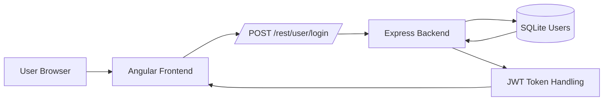
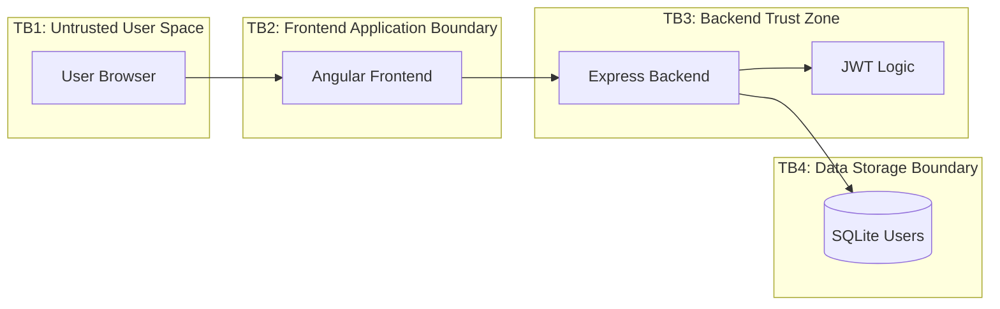

# Threat Modeling / Risk Assessment of OWASP Juice Shop

## Summary
The purpose of this project is to do a simulated threat modeling of the popular, intentionally vulnerable web app OWASP Juice Shop. We will focus on assessing 3 features of the application:

1. The login authentication flow
2. The inventory search feature
3. The profile image upload feature

For each feature, we will do the following:

1. Create a System Architecture Overview
2. Outline a Data Flow Diagram
3. Create a Trust Boundary Diagram
4. Analyze threats following the STRIDE framework
5. Outline a risk register
6. Conduct a gap analysis
7. Map risks to ISO 27001 and NIST SP 800-53 controls

Let's get started!

## Table of Contents
* [Login Authentication](#auth)
* [Inventory Search](#search)
* [Profile Image Uplaod](#upload)

## 1. Login Authentication Threat Model

### Objective
Assess the authentication feature for security risks related to credential submission, token issuance, session trust, and authorization dependencies.

### Scope
- Login submission
- Backend credential validation
- Token issuance and return to client
- Authentication-related trust boundaries

### Included
- Architecture overview
- Data flow diagram
- Trust boundary diagram
- STRIDE analysis
- Gap analysis
- Risk register
- NIST / ISO mapping

### 1.1 Architecture Overview

### 1.2 Data Flow Diagram

#### Flow
1. User enters email and password in the browser
2. Angular frontend sends login request to backend
3. Express login handler validates credentials against user data
4. Backend issues authentication token on success
5. Token and auth state are returned to the client

#### Security-Critical Points
- Credentials cross from untrusted user space into the application
- User lookup and password validation happen server-side
- Token generation and validation are high-trust functions

### 1.3 Trust Boundary Diagram

### 1.4 STRIDE Analysis

| Threat | Example | Risk |
|------|--------|------|
| Spoofing | Brute force login | High |
| Tampering | Modify login request | Medium |
| Repudiation | No login logs | Medium |
| Info Disclosure | Error leaks | High |
| DoS | Login flooding | Medium |
| EoP | JWT manipulation | Critical |

### 1.5 Risk Register

| Risk | STRIDE | Likelihood | Impact | Risk Level | Mitigation |
|---|---|---|---|---|---|
| Brute-force / credential stuffing | Spoofing | High | High | Critical | Rate limiting, lockout, MFA |
| Token forgery or weak validation | Elevation of Privilege | Medium | Critical | Critical | Signature verification, strict token validation |
| Verbose login error responses | Information Disclosure | High | Medium | High | Generic error messages |
| Incomplete login audit trail | Repudiation | Medium | Medium | Medium | Centralized auth logging |
| Session hijack / token misuse | Tampering / EoP | Medium | High | High | Secure token storage and expiration |

### 1.6 Gap Analysis

| Expected Control | Status | Gap | Impact | Recommended Remediation |
|---|---|---|---|---|
| Brute force login protection | Not evident | Rate limiting on login attempts does not seem to be present within the scope. | Increases the likelihood of user impersonation, which may lead to complete account compromise and sensitive information disclosure. | Lockout policy on failed login attempts and enforcing strong password policy upon account creation. | 
| Logging login activity | Not evident | Auditing login attempts does not seem evident within the scope. | Increases likelihood of repudiation without audit logs. | Securely store logs on web server log files. | 
| Generic error messages upon failed login | Requires validation | Generic error messages should be given for all failed login cases to prevent attackers from enumerating valid users from them. | Increases the likelihood of user enumeration, which may be later used for further attacks. | Implement generic error messages for all login errors. | 

### 1.7 Compliance Mapping

| Risk ID | Risk | NIST SP 800-53 | ISO 27001 |
|---|---|---|---|
| AUTH-01 | Brute-force / credential stuffing | AC-7, IA-2 | A.9 |
| AUTH-02 | Token forgery or weak validation | IA-5, SC-23 | A.10, A.9 |
| AUTH-03 | Verbose login error responses | SI-11 | A.14 |
| AUTH-04 | Incomplete login audit trail | AU-2, AU-12 | A.12.4 |
| AUTH-05 | Session hijack / token misuse | IA-5, AC-6 | A.9, A.10 |
