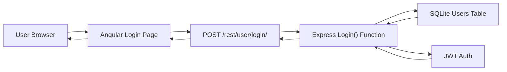
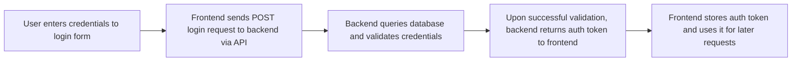
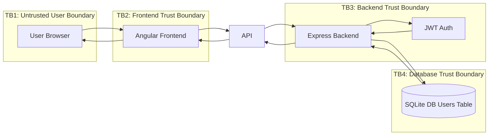
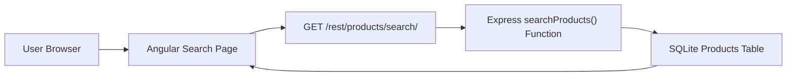
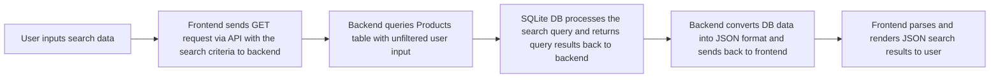

# Threat Modeling / Risk Assessment of OWASP Juice Shop

## Summary
The purpose of this project is to do a simulated threat modeling of the popular, intentionally vulnerable web app OWASP Juice Shop. We will focus on assessing 3 features of the application:

1. The login authentication flow
2. The product search feature
3. The profile image upload feature

For each feature, we will do the following:

1. Create a System Architecture Overview
2. Outline a Data Flow Diagram
3. Create a Trust Boundary Diagram
4. Outline a risk register and analyze using STRIDE model
5. Conduct a gap analysis
6. Map risks to ISO 27001 and NIST SP 800-53 controls

Let's get started!

## Table of Contents
* [Login Authentication](#auth)
* [Inventory Search](#search)
* [Profile Image Uplaod](#upload)

## 1. Login Authentication Threat Model

### Objective
Assess the authentication feature for security risks related to credential submission, token issuance, session trust, and authorization dependencies.

### Scope
- Login submission
- Backend credential validation
- Token issuance and return to client
- Authentication-related trust boundaries

### Process
- Architecture overview
- Data flow diagram
- Trust boundary diagram
- STRIDE analysis
- Gap analysis
- Risk register
- NIST / ISO mapping

### 1.1 Architecture Overview

### 1.2 Data Flow Diagram

### 1.3 Trust Boundary Diagram

### 1.4 Risk Register

| Risk | STRIDE | Likelihood | Impact | Mitigation |
|---|---|---|---|---|
| Brute force login | Spoofing | High | High | Rate limiting, account lockout policy, MFA |
| JWT Token forgery | Tampering | Medium | Critical | Signature verification, strict token validation |
| No login audit logs | Repudiation | Medium | Medium | Implement auth logging |
| Verbose login error responses | Information Disclosure | High | Medium | Generic error messages |
| SQL Injection | Elevation of Privilege / Spoofing | High | Critical | WAF, parameterized queries, input sanitization |

### 1.5 Gap Analysis

| Risk | Expected Control | Status | Gap | Impact | Recommended Remediation |
|---|---|---|---|---|---|
| Brute force login | Brute force login protection | Not evident | Rate limiting on login attempts does not seem to be present within the scope. | Increases the likelihood of user impersonation, which may lead to complete account compromise and sensitive information disclosure. | Lockout policy on failed login attempts and enforcing strong password policy upon account creation. | 
| JWT Token forgery | Token signing | Present within scope | Auth tokens should be signed to prevent tampering or impersonation. | Absence of token signing may allow attackers to craft or modify their own token to elevate privileges or impersonate another user. | Implement token signing and validation. |
| No login audit logs | Logging login activity | Not evident | Auditing login attempts does not seem evident within the scope. | Increases likelihood of repudiation without audit logs. | Securely store logs on web server log files. | 
| Verbose login error responses | Generic error messages upon failed login | Requires validation | Generic error messages should be given for all failed login cases to prevent attackers from enumerating valid users from them. | Increases the likelihood of user enumeration, which may be later used for further attacks. | Implement generic error messages for all login errors. | 
| SQL Injection | Backend uses parameterized queries to query database | Not evident | the `login()` function does not utilize parameterized queries | SQL Injection may lead to the disclosure of sensitive information or in severe cases, bypassing authentication or remote code execution. | Parameterized queries should be implemented when querying the database. Also doing input santization on user input is highly recommended. |

### 1.6 Compliance Mapping

| Risk | NIST SP 800-53 | ISO 27001 |
|---|---|---|
| Brute-force / credential stuffing | AC-7, IA-2 | A.9 |
| JWT Token forgery | IA-5, SC-23 | A.10, A.9 |
| Incomplete login audit trail | AU-2, AU-12 | A.12.4 |
| Verbose login error responses | SI-11 | A.14 |
| SQL Injection | SI-10, SI-15 | A.8.25, A.8.26 |

=========

## 2. Product Search Threat Model

### Objective
Assess the product search and catalog discovery feature for risks related to user-controlled input, data retrieval, query handling, and result output.

### Scope
- Search term input submission
- Backend search processing and input handling
- Product lookup and result rendering

### Process
- Architecture overview
- Data flow diagram
- Trust boundary diagram
- STRIDE analysis
- Gap analysis
- Risk register
- NIST / ISO mapping

### 2.1 Architecture Overview

### 2.2 Data Flow Diagram

### 2.3 Trust Boundary Diagram

### 2.4 Risk Register

### 2.5 Gap Analysis

### 2.6 Compliance Mapping

| Risk ID | Risk | NIST SP 800-53 | ISO 27001 |
|---|---|---|---|
| SEARCH-01 | Unsafe query behavior from search input | SI-10 | A.14.2 |
| SEARCH-02 | Sensitive or hidden product data exposed | AC-3, AC-6 | A.8, A.9 |
| SEARCH-03 | Expensive search patterns degrade availability | SC-5 | A.17 |
| SEARCH-04 | Search abuse not well attributable | AU-2 | A.12.4 |
| SEARCH-05 | Filter bypass reveals unintended catalog state | AC-3 | A.9 |
